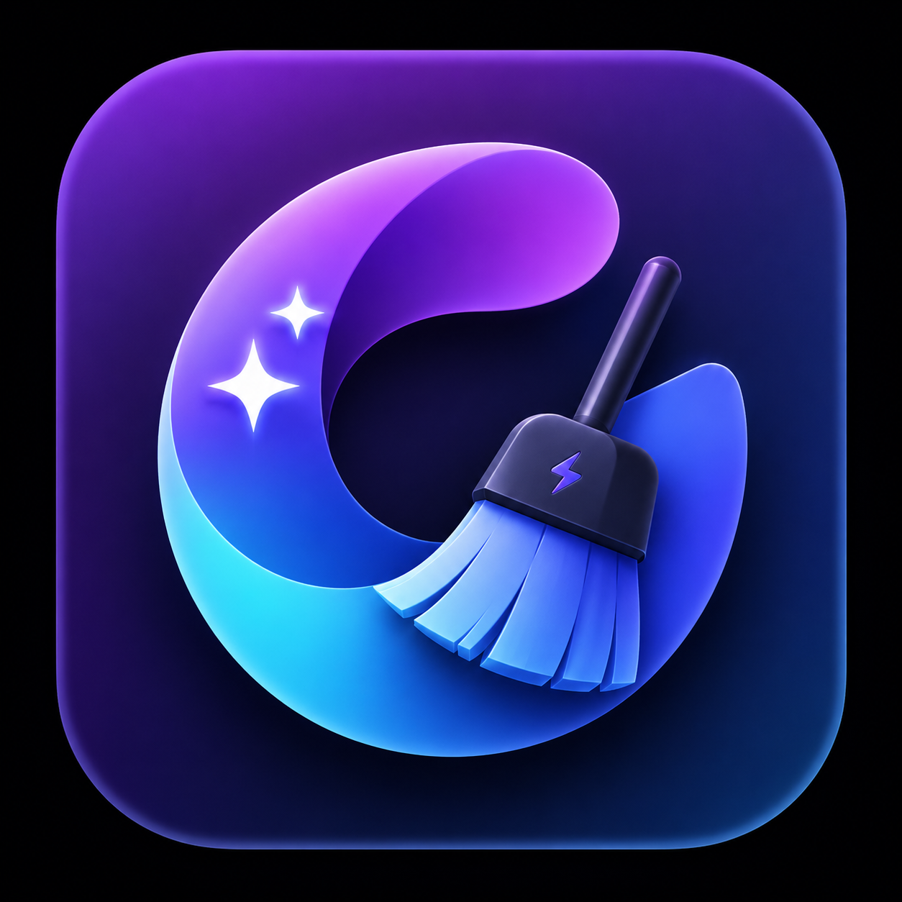

<p align="center">
  
</p>

<h1 align="center">Mac Clean</h1>

<p align="center">
  <strong>The open-source Mac cleaner, optimizer, and malware scanner.</strong><br>
  A feature-complete, free alternative to CleanMyMac — built with Swift 6 and SwiftUI.
</p>

<p align="center">
  
  
  
  
  
  
</p>

---

## What is Mac Clean?

Mac Clean is a **free, open-source** macOS app that cleans junk files, removes malware, optimizes performance, uninstalls apps completely, and visualizes disk usage — all from a single, beautiful interface. It replicates every major feature of CleanMyMac while being fully transparent and community-driven.

**No subscriptions. No telemetry. No ads. Just a clean Mac.**

## Features

### Cleanup
| Module | Description |
|--------|------------|
| **Smart Scan** | One-click scan combining cleanup, protection, and performance analysis with live progress across 13 modules |
| **System Junk** | 16 scan categories — user/system caches, logs, language files, broken preferences, broken login items, document versions, iOS backups, Xcode junk, universal binaries, deleted users, and more |
| **Mail Attachments** | Find cached attachments from Apple Mail, Outlook, and Spark |
| **Trash Bins** | Empty trash from all locations including external drives |

### Protection
| Module | Description |
|--------|------------|
| **Malware Removal** | Signature-based scanning with 3 depths (Quick / Balanced / Deep), checks launch agents/daemons, browser extensions, and known malware patterns |
| **Privacy** | Clean Safari, Chrome, and Firefox data — history, cookies, cache. System traces cleanup with time filters |

### Performance
| Module | Description |
|--------|------------|
| **Optimization** | Manage login items and launch agents with enable/disable toggles |
| **Maintenance** | 10 system tasks — free RAM, run maintenance scripts, repair permissions, rebuild Launch Services, reindex Spotlight, flush DNS, thin Time Machine snapshots |

### Applications
| Module | Description |
|--------|------------|
| **Uninstaller** | 10-level app matching engine that finds every associated file across 17+ Library subdirectories. Complete removal, app reset, unused app detection |
| **Updater** | Check for available updates across installed apps via Sparkle appcast feeds |

### Files
| Module | Description |
|--------|------------|
| **Space Lens** | Squarified treemap visualization of disk usage with drill-down navigation |
| **Large & Old Files** | Find files >50 MB sorted by size and last access date |
| **Duplicates** | Progressive detection — size grouping → partial SHA-256 (4KB) → full hash → inode verification |
| **Shredder** | Secure file erasure with standard, permanent, and secure overwrite modes |

### Menu Bar Monitor
Independent menu bar app with **real-time system stats**:
- CPU load via `host_processor_info` (Mach API)
- Memory pressure via `vm_statistics64`
- Disk usage and health
- Battery charge, health, cycle count, temperature
- Network throughput via `getifaddrs`

## Architecture

```
Mac Clean
├── MacClean          — Main SwiftUI app (14 modules, 15 views)
├── MacCleanKit       — Shared framework (models, constants, protocols)
├── MacCleanHelper    — XPC privileged helper (LaunchDaemon for root ops)
├── MacCleanMenu      — Menu bar monitor (independent process)
└── MacCleanTestRunner — Standalone test suite (56 tests)
```

### Tech Stack

| Layer | Technology |
|-------|-----------|
| Language | Swift 6 with strict concurrency |
| UI | SwiftUI + AppKit hybrid |
| Concurrency | Actors, TaskGroup, async/await, @Sendable |
| Database | GRDB.swift (SQLite) with WAL mode |
| File Scanning | URLResourceKey prefetching on APFS |
| Incremental Updates | FSEvents with historical replay |
| Privileged Ops | SMAppService + NSXPCConnection |
| System Stats | Mach APIs (host_processor_info, vm_statistics64, proc_pidinfo) |

### Safety Model

Mac Clean is designed to **never cause data loss**:

- **Protected paths blocklist** — `/System`, `/usr`, `/bin`, `/sbin`, Apple system apps are untouchable
- **Trash-first deletion** — all removals go to Trash by default
- **Dry-run mode** — preview what would be deleted without touching anything
- **TOCTOU prevention** — symlinks re-resolved immediately before deletion
- **10,000 file cap** — prevents runaway deletion operations
- **Orphan safety policy** — orphan cleanup restricted to caches/logs only
- **Operation logging** — every action logged to `~/Library/Logs/MacClean/`

## Getting Started

### Requirements

- macOS 14 (Sonoma) or later
- Xcode 15+ or Swift 6 toolchain
- Full Disk Access (for Mail, Safari, browser data scanning)

### Build & Run

```bash
# Clone
git clone https://github.com/YOUR_USERNAME/MacClean.git
cd MacClean

# Build
swift build

# Run tests
swift run MacCleanTestRunner

# Run the app (creates a temp .app bundle)
APP_DIR="/tmp/MacClean.app/Contents"
mkdir -p "$APP_DIR/MacOS" "$APP_DIR/Resources"
cp "$(swift build --show-bin-path)/MacClean" "$APP_DIR/MacOS/MacClean"
cp Resources/AppIcon.icns "$APP_DIR/Resources/" 2>/dev/null
cat > "$APP_DIR/Info.plist" << 'EOF'
<?xml version="1.0" encoding="UTF-8"?>
<!DOCTYPE plist PUBLIC "-//Apple//DTD PLIST 1.0//EN"
  "http://www.apple.com/DTDs/PropertyList-1.0.dtd">
<plist version="1.0">
<dict>
  <key>CFBundleExecutable</key><string>MacClean</string>
  <key>CFBundleIdentifier</key><string>com.macclean.app</string>
  <key>CFBundleName</key><string>Mac Clean</string>
  <key>CFBundleDisplayName</key><string>Mac Clean</string>
  <key>CFBundleIconFile</key><string>AppIcon</string>
  <key>CFBundlePackageType</key><string>APPL</string>
  <key>CFBundleVersion</key><string>1.0.0</string>
  <key>CFBundleShortVersionString</key><string>1.0.0</string>
  <key>LSMinimumSystemVersion</key><string>14.0</string>
  <key>NSPrincipalClass</key><string>NSApplication</string>
  <key>NSHighResolutionCapable</key><true/>
</dict>
</plist>
EOF
codesign --force --sign - /tmp/MacClean.app
open /tmp/MacClean.app
```

### Build DMG for Distribution

```bash
bash scripts/build-dmg.sh
# Output: .build/MacClean-1.0.0.dmg
```

### Granting Full Disk Access

Some modules (Mail Attachments, Privacy, Malware) need Full Disk Access to scan protected areas:

1. Open **System Settings → Privacy & Security → Full Disk Access**
2. Click **+** and navigate to the Mac Clean app
3. Enable the toggle
4. Restart Mac Clean

## Project Structure

```
Sources/
├── MacClean/
│   ├── App/                    # App entry point, state, content view
│   ├── Core/
│   │   ├── Scanner/            # FileTreeScanner, TargetedScanner, ScanCoordinator
│   │   ├── Cleaner/            # CleaningEngine, SafetyGuard
│   │   ├── Cache/              # GRDB database layer
│   │   └── FSMonitor/          # FSEvents incremental watcher
│   ├── Modules/                # 13 scan modules
│   │   ├── SystemJunk/         # 16 junk categories
│   │   ├── Malware/            # Signature scanner + real-time monitor
│   │   ├── Uninstaller/        # 10-level app matching engine
│   │   ├── SpaceLens/          # Squarified treemap algorithm
│   │   ├── Duplicates/         # Progressive hash pipeline
│   │   └── ...
│   ├── Views/                  # SwiftUI views (14 module views + shared components)
│   ├── ViewModels/             # @Observable view models
│   ├── Services/               # PermissionManager, XPCClient
│   └── Utilities/              # SuperEllipse shape, extensions
├── MacCleanKit/                # Shared models, constants, protocols
├── MacCleanHelper/             # XPC privileged helper (root operations)
├── MacCleanMenu/               # Menu bar system monitor
└── MacCleanTestRunner/         # 56 standalone tests
```

## Tests

```bash
swift run MacCleanTestRunner
```

```
Results: 56 passed, 0 failed, 56 total
```

Tests cover:
- File scanning (URLResourceKey prefetch, directory enumeration)
- Safety guard (protected paths, symlink detection, file caps)
- Cleaning engine (dry-run, trash, logging)
- Database operations (GRDB migrations, CRUD)
- All 16 system junk categories (path validation, filter logic)
- Size formatting (bytes → human-readable)
- Malware signatures (pattern matching)
- App matching (10 match levels)
- Treemap layout (squarified algorithm)
- Live system checks (caches, logs, volumes, Trash)

## Security

Mac Clean takes security seriously:

- **No network access** — the app never phones home, no telemetry, no analytics
- **No elevated privileges by default** — XPC helper only activated for maintenance tasks
- **Code signature verification** — XPC helper validates caller identity
- **Protected paths** — 27+ Apple system apps and all SIP-protected paths are blocklisted
- **Open source** — every line of code is auditable

### Security Audit Checklist

- [x] No command injection vectors (all Process args are hardcoded constants)
- [x] No arbitrary file deletion (SafetyGuard validates every path)
- [x] TOCTOU race condition prevention (symlink re-resolution before delete)
- [x] File operation caps (10,000 file limit per operation)
- [x] XPC caller validation (code signature check)
- [x] No secrets or credentials in source
- [x] Trash-first policy (recoverable by default)
- [x] Operation audit log (every action recorded)

## Contributing

We welcome contributions! Please read our [Contributing Guidelines](CONTRIBUTING.md) before submitting a PR.

### Quick Start

1. Fork the repo
2. Create a feature branch (`git checkout -b feature/amazing-feature`)
3. Make your changes
4. Run tests (`swift run MacCleanTestRunner`)
5. Commit (`git commit -m 'Add amazing feature'`)
6. Push (`git push origin feature/amazing-feature`)
7. Open a Pull Request

## License

This project is licensed under the **BSD 3-Clause License** — see the [LICENSE](LICENSE) file for details.

This means you can use, modify, and redistribute this code, but you **must**:
- Include the original copyright notice
- Include the license text
- **Not** use the name "Mac Clean" or contributors' names to endorse derived products without permission

## Acknowledgments

Inspired by the open-source Mac utility community:
- [Pearcleaner](https://github.com/alienator88/Pearcleaner) — app uninstaller patterns
- [Mole](https://github.com/nicehash/Mole) — cleanup categories
- [Tencent Lemon Cleaner](https://github.com/nicehash/Lemon) — modular architecture
- Squarified Treemap algorithm by Bruls, Huizing & van Wijk (2000)

---

<p align="center">
  <strong>Mac Clean is free software built by the community, for the community.</strong><br>
  If you find it useful, please star the repo and share it with others.
</p>
